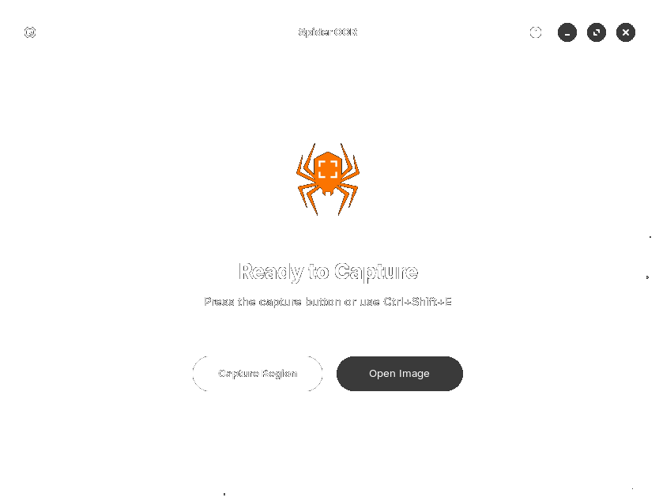

# Spider OCR

> Intuitive text extraction tool (OCR) for GNOME.

<div align="center">
<figure>

</figure>
</div>

Quickly extract text from almost any source: YouTube, screencasts, PDFs, webpages, photos, etc.  
Grab the image and get the text.

Spider OCR is a premium, high-performance desktop application for Linux designed to capture regions of your screen and instantly extract text using advanced OCR engines. Built with **GTK4** and **Libadwaita**, it offers a native, modern experience with a focus on speed and stability.

## See it in action

<div align="center">

</div>

## Get Spider

Spider OCR currently supports building from source.

### Manual Build
```bash
git clone https://github.com/OMARxKHALID/spider.git
cd spider
chmod +x install.sh
./install.sh
```

### Launch
```bash
./builddir/org.domain.Spider
```

## :tada: Support
If you like Spider and you want to support its development, you can support me on GitHub:

<a href="https://github.com/OMARxKHALID/spider" target="_blank"></a>

## Building

I recommend using [GNOME Builder](https://wiki.gnome.org/Apps/Builder) to develop and build the application.
To build the Spider application, just open the project folder in Builder and press **Run** (Ctrl+F5). It will automatically handle dependencies and environment setup.

## Code of Conduct

Spider OCR follows the GNOME project [Code of Conduct](https://gitlab.gnome.org/World/amberol/-/blob/main/code-of-conduct.md). All communications in project spaces are expected to follow it.

## Contribution

Any help is appreciated! Feel free to open issues or pull requests.

## Thanks

Special thanks to the open-source community for the powerful tools (Tesseract, OpenCV, Libadwaita) that make this project possible.
