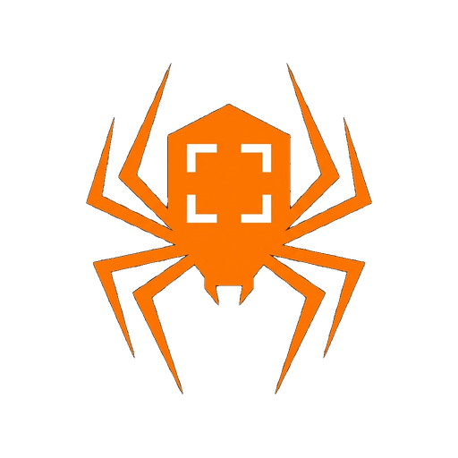
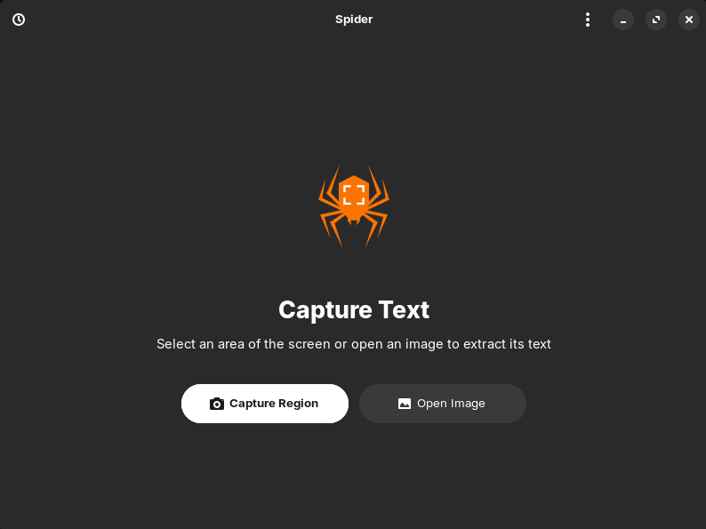

#  Spider 🕷️



A fast, lightweight, and modern desktop OCR tool for Linux built with Python, GTK4, Libadwaita, and Tesseract. Spider enables you to instantly extract text from screen regions or image files with offline processing and high accuracy.

## Features

- **Region Capture:** Instantly grab a portion of your screen (X11 & Wayland supported via XDG Desktop Portals).
- **Offline OCR:** Powered entirely by Tesseract OCR — all processing happens locally. No internet connection required.
- **Image Preprocessing:** Handles dark mode, colored buttons, small text, skewed scans and JPEG photos, and keeps line breaks, paragraphs and code indentation.
- **Searchable History:** Recognized text (not the screenshot) is saved locally into a blazing-fast SQLite FTS5 database, capped at 500 records to preserve storage.
- **GTK4/Libadwaita UI:** Dark mode support, Wayland-native, labelled controls for screen readers.

---

## Installation

### Dependencies

Ensure you have the following system dependencies installed:

- `tesseract-ocr` and English language data (`tesseract-ocr-eng`)
- `python3` (>=3.10)
- GTK 4 and libadwaita ≥ 1.5 introspection data (`gir1.2-gtk-4.0`, `gir1.2-adw-1`)
- OpenCV and PyGObject (`python3-opencv`, `python3-gi`)

### Installing from Source (Meson)

```bash
git clone https://github.com/OMARxKHALID/spider.git
cd spider
meson setup build
meson compile -C build
sudo meson install -C build
```

### Flatpak

A Flatpak manifest is provided in `build-aux/org.domain.Spider.json`. It targets the GNOME 50 runtime and builds OpenCV, Leptonica and Tesseract from source, so every dependency is pinned by checksum.

```bash
flatpak install --user flathub org.gnome.Sdk//50 org.flatpak.Builder
flatpak run org.flatpak.Builder --user --install --force-clean build-dir build-aux/org.domain.Spider.json
flatpak run org.domain.Spider
```

---

## Technical Details

### Smart Preprocessing

Spider prepares each image before handing it to Tesseract:

1. Detects light text on dark or colored backgrounds and flips it to dark-on-light, then stretches contrast.
2. Straightens skewed scans and photos using a projection-profile search (screen captures are left untouched).
3. Measures the actual text height and upscales only as much as needed, within a memory budget.
4. Rebuilds the text layout from word positions, keeping line breaks, paragraph gaps and code indentation.

### Storage & Security

Data is stored locally under `~/.local/share/spider/history.db` with strict `0700` permissions. OCR runs on a worker thread and a generation counter discards results from timed-out or superseded runs.

---

## License

Spider is free software, released under the [GNU General Public License v3.0 or later](LICENSE).
